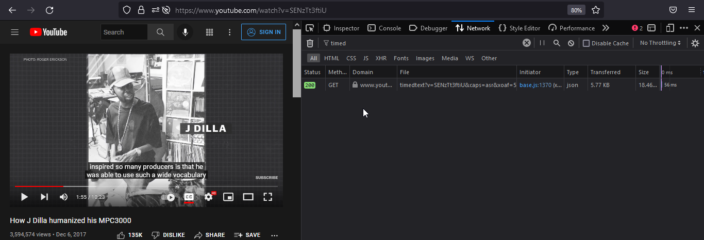

# Python Utils

[JSONtoSRT](./JSONtoSRT/JSONtoSRT.py) converts youtube subtitles/cc to srt file. The youtube captions may be downloaded manually, here a example how to download youtube captions manually

Using the developer tools and shearching for timedtext you can download a subtitles/cc json file.



How to use:

For autogenerated subtitles/cc

``` python subtitlesFile.json fileName aut ```

For original subtitles/cc

``` python subtitlesFile.json fileName org ```


[JoinFile](./JoinFile/JoinFile.py) concats files using ffmepg 


